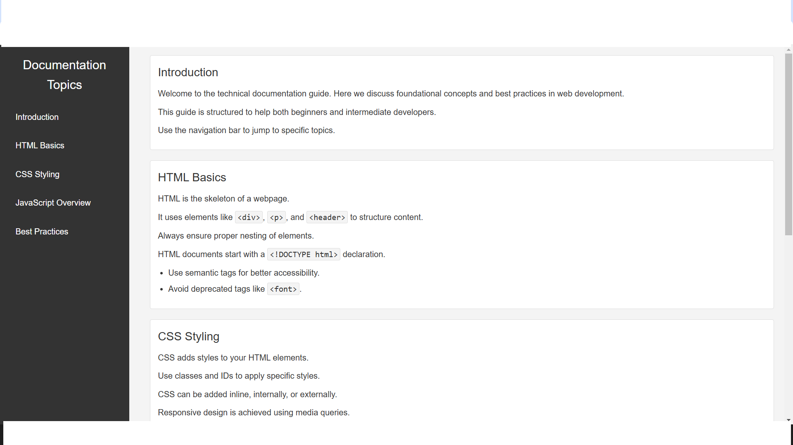

# Technical-Documentation-Page

## Screenshot

## Table of Contents

- [Introduction](#introduction)
- [HTML Basics](#html-basics)
- [CSS Styling](#css-styling)
- [JavaScript Overview](#javascript-overview)
- [Best Practices](#best-practices)

## Introduction

Welcome to the technical documentation guide. Here we discuss foundational concepts and best practices in web development. This guide is structured to help both beginners and intermediate developers. Use the navigation bar to jump to specific topics.

## HTML Basics

HTML is the skeleton of a webpage. It uses elements like `
`, `
`, and `<header>` to structure content. Always ensure proper nesting of elements. HTML documents start with a `<!DOCTYPE html>` declaration.

- Use semantic tags for better accessibility.
- Avoid deprecated tags like ``.

## CSS Styling

CSS adds styles to your HTML elements. Use classes and IDs to apply specific styles. CSS can be added inline, internally, or externally. Responsive design is achieved using media queries.

- Use `flexbox` and `grid` for layouts.
- Avoid excessive inline styles.

## JavaScript Overview

JavaScript brings interactivity to your web pages. It runs in the browser and manipulates the DOM. Popular use cases include event handling and API calls. Always use `let` and `const` instead of `var`.

- Use modern ES6 features.
- Avoid global variables.

## Best Practices

Write clean and maintainable code. Follow standard conventions for naming files and variables. Use version control systems like Git. Test your code thoroughly before deployment.

- Comment your code when necessary.
- Optimize for performance.